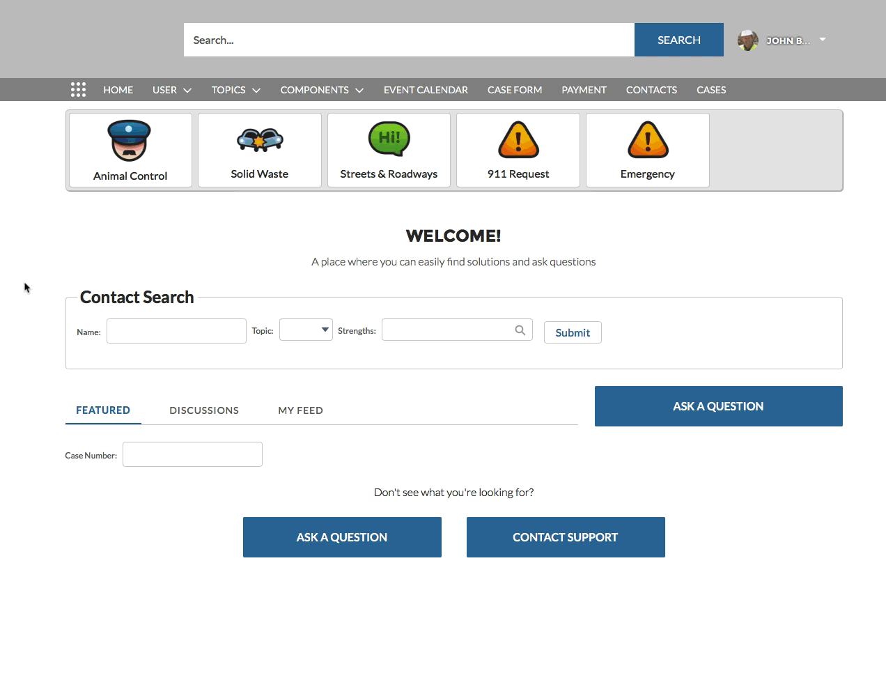

# PSCommUserRedirect
Lightning component that allows a community user to redirect to their user, contact, or account records. This component fills a product gap where you cannot easily create community navigation items that take the user to their profile, contact, or account record. 

<b>To deploy and use this component:</b>
  1. Deploy the component to your org using "Deploy to Salesforce" button below
  2. In community builder, create a New Page > Standard Page > 1 full-width column
     - Give the new page a name like "My Account" or "My Profile"
  3. Drag the PSCommUserRedirect component on the page in the main content section
  4. Click on the component (it is a headless component so it will not show anything) and configure it to redirect you to either User, Contact or Account record.
  5. Edit your Community Navigation Menu and create a new nav entry and select the page you created above. For example, create a "My Account" navigation menu item if you configured your component route to the user's Account record.
  6. Repeat steps 2-5 if you want to route to other user related records (User, Contact, or Account).

